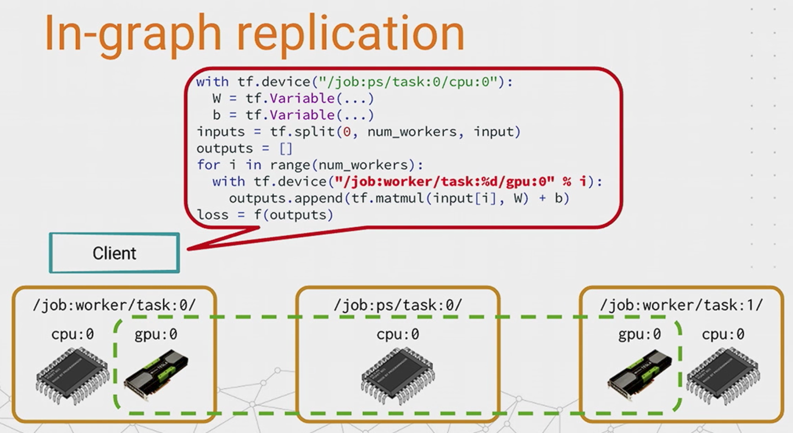
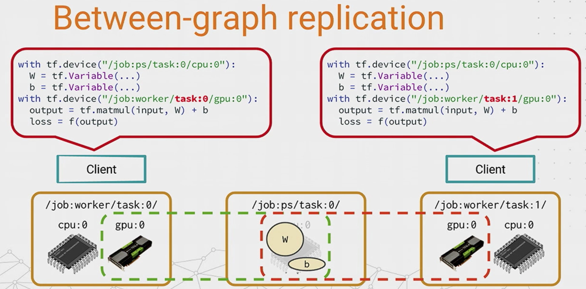

# How CNN works

## 1. convolution layer

filter == pattern matching

pool == 1. shrink image, 2. less sensitive to pattern position

ReLU == non-linear learning, simple activition fn

Fully-Connected == using all extract feature to make final decision vote.

*NOTE*

If your data is useful after swaping any columns (i.e. cannot be transformed as a image (adjacent pixels are related)), then CNN cannot work.

### Tensorflow

between graph relication is more efficient than in-graph replication.

In graph replication

Between graph replication

